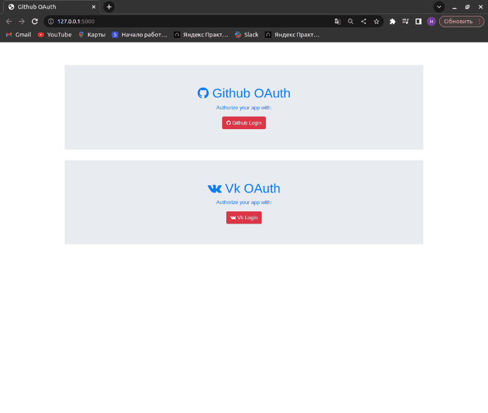
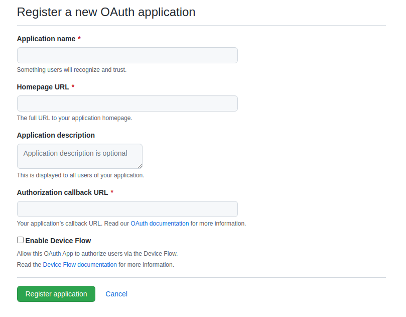
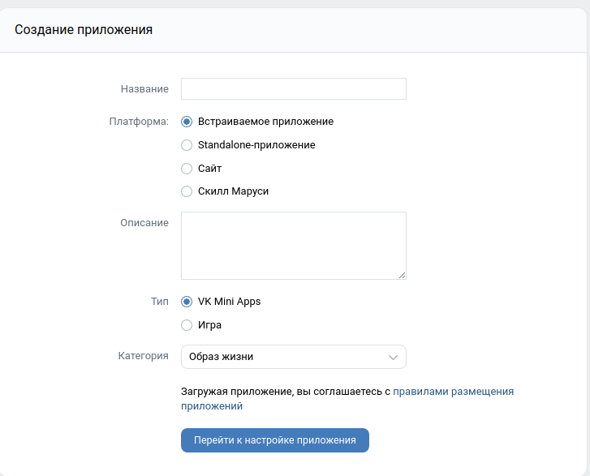

# Задача:
    1. Выполнить аутентификацию через GitHub
    2. Выполнить аутентификацию через Vk
    2. Выполнить аутентификацию через Yandex

# Запуск
    1. git clone https://github.com/Alset-Nikolas/auth_JWT.git
    2. python3 -m venv venv
    3. source venv/bin/activate
    4. pip install -r requirements.txt
    5. python3 auth/main.py

# Иллюстрация работы 

# Для запуска необходимо настроить Приложения (Git, vk, yandex):
    __________________________GIT_____________________________
        нужны CLIENT_GITHUB_ID, CLIENT_GITHUB_SECRET

        1.1 Заходим на https://github.com/settings/developers
        1.2 Создаем приложение -> New Oauth App
        1.3 Заполняем форму

        
            Homepage URL: http://127.0.0.1:5000
            Authorization callback URL: http://127.0.0.1:5000/github/callback
            Application name: test_name

        1.4 Ура мы узнаем 'Client ID', 'Client secret'

    _________________________VK______________________________
        нужны (CLIENT_VK_ID, CLIENT_VK_SECRET)

        3.1 Заходим на https://vk.com/editapp?act=create
        3.2 Заполняем форму

            
            Название: test_name
            Платформа: Standalone-приложение
        3.3 Заходим в настройки нашего приложения
        3.4 Заполням настройки:
            Open API: Включен
            Адрес сайта: http://127.0.0.1:5000	
            Базовый домен:127.0.0.1
            Доверенный redirect URI: http://127.0.0.1:5000/vk-gateway
        3.5 Сохраням и записываем 'ID приложения' и 'Защищённый ключ'
